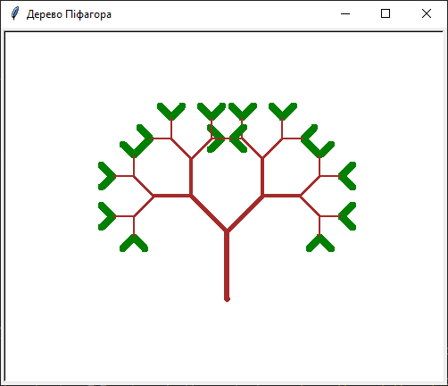
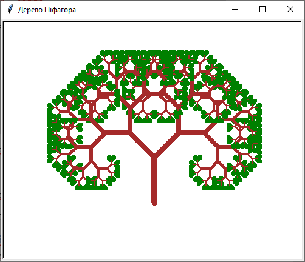
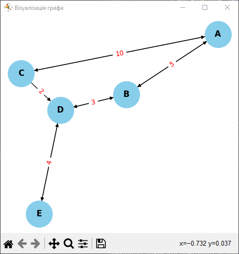
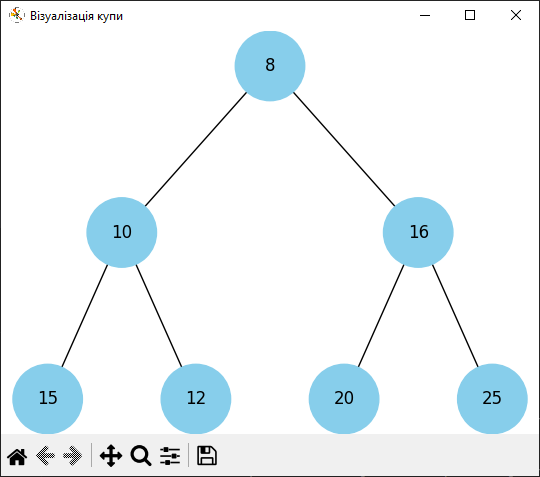
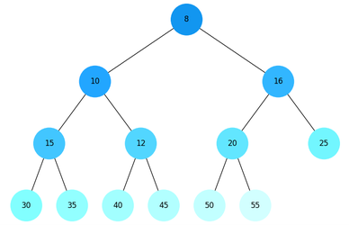
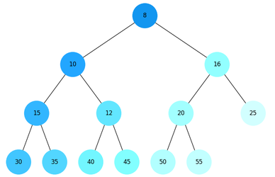
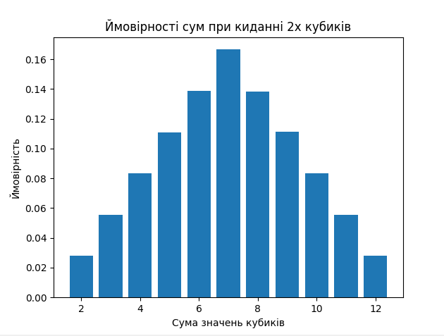

# goit-algo-fp

## 1. Структури даних. Сортування. Робота з однозв'язним списком

Реалізовано функцію реверсування однозв'язного списку `reverse`, яка змінює посилання між вузлами.

```
Реверсування зв'язного списку:
оригінал: 35 -> 15 -> 5 -> 20 -> 25
реверс:   25 -> 20 -> 5 -> 15 -> 35 
```

Реалізовано алгоритм сортування для однозв'язного списку

```Py
def insertion_sort(self, asc=True) 
```

За допомогою параметра `asc` можна задати сортування за зростанням або за спаданням

```
Сортування зв'язного списку:
оригінал:  25 -> 20 -> 5 -> 15 -> 35
зростання: 5 -> 15 -> 20 -> 25 -> 35
спадання:  35 -> 25 -> 20 -> 15 -> 5
```

Реалізовано функцію, що об'єднує два відсортовані однозв'язні списки в один відсортований список

```Py
def merge_sorted_lists(self, other_list)	

Об'єднання двох зв'язних списків:
Список_1: 1 -> 3 -> 5 -> 7
Список_2: 2 -> 4 -> 6
Об'єднаний список: 1 -> 2 -> 3 -> 4 -> 5 -> 6 -> 7
```

## 2. Рекурсія. Створення фрактала “дерево Піфагора” за допомогою рекурсії

Фукнція `draw_pifagor_tree` створює фрактал “дерево Піфагора” за допомогою рекурсії.

Додатково реалізовано метод `level_config`, який стилізує фрактал під справжнє дерево:

-   Гілки зображені коричневим кольором
-   Їх товщина зменшується від стовбура до листя
-   Листя (level=1) малюються зеленим кольором

```Py
def level_config(t: turtle.Turtle, level: int):
    """
    Налаштування гілок в залежнотсі від рівня:
    імітує стовбур, гілки і листя
    level = 0 - зелена;
    level = 1 - коричнева;
    """
    if level > 1:
        t.color("brown")
        t.width(level)
    else:
        t.color("green")
        t.width(8)
```

Результат для рівня рекурсії 6



Результат для рівня рекурсії 10



## 3. Дерева, алгоритм Дейкстри

Реалізовано алгоритм Дейкстри для знаходження найкоротших шляхів у зваженому графі, із використанням бінарної купи (модуль heapq).

```Py
def dijkstra(graph, start_vertex, end_vertex=None) -> dict:
    """Алгоритм Дейкстри

    Параметри:
        graph: dict - граф;
        start_vertex - початкова вершина;
        end_vertex - кінцева вершина.
    Повертає dict:
        distances:dict|int - відстані від початкової до всіх вершин, або відстань до заданої end_vertex.;
        path:list - оптимальний шлях якщо задана end_vertex або None.

    """
```

В коді також реалізовано візуалізацію графа з ребрами, пропорційними їх вазі, підписами вузлів та вагою ребер:

```Py
def graph_show(G: nx.DiGraph) -> None:
    """Візуалізація графа

    Візуалізація графа з вагами ребер. Використовуємо бібліотеку networkx.
    Довжини ребер пропорційні їх вазі.
    """
```



Розрахунки маршрутів з вершини A для наведеного графа:

```
Найкоротші шляхи від початкової вершини A до всіх вершин:
A -> B:   5, маршрут: ['A', 'B']
A -> C:  10, маршрут: ['A', 'C']
A -> D:   8, маршрут: ['A', 'B', 'D']
A -> E:  12, маршрут: ['A', 'B', 'D', 'E']
```

## 4. Візуалізація піраміди

Код виконує візуалізацію дерева та бінарної купи.

Візуалізація бінарної купи реалізована через проміжне перетворення її в дерево.  
Таким чином зберігаються всі властивості класу `Node`:

-   параметри:
    -   `id` вузла
    -   нащадки (`left`, `right`)
    -   колір вузла
    -   значення
-   методи
    -   `count_nodes` – обрахунок к-ті вузлів дерева
    -   `__str__` – текстове представлення дерева

Результат візуалізації для

heap = [8, 10, 16, 15, 12, 20, 25]



## 5. Візуалізація обходу бінарного дерева

Реалізовано 2 метода:

-   `bfs_tree`
-   `dfs_tree`

Методи візуалізують обхід дерева у глибину та в ширину відповідно.  
Кожен наступний крок обходу відображається світлішим кольором вузла.



## 6. Жадібні алгоритми та динамічне програмування

Реалізовано два підходи — жадібний алгоритм та алгоритм динамічного програмування для розв’язання задачі вибору їжі з найбільшою сумарною калорійністю в межах обмеженого бюджету:

-   `greedy_algorithm(items: dict, budget: int) -> tuple` – жадібний алгоритм
-   `dynamic_programming(items: dict, budget: int) -> tuple` – алгоритм динамічного програмування

Для вихідного набору страв

```Py
items = {
    "pizza": {"cost": 50, "calories": 300},
    "hamburger": {"cost": 40, "calories": 250},
    "hot-dog": {"cost": 30, "calories": 200},
    "pepsi": {"cost": 10, "calories": 100},
    "cola": {"cost": 15, "calories": 220},
    "potato": {"cost": 25, "calories": 350},
}
```

Результати виконання функцій:

```
Вибір страв з найбільшою сумарною калорійністю для бюджету: 90₴:
Жадібний алгоритм:
-страви: ['pizza', 'hamburger']
-сумарна калорійність: 550
-сумарна вартість: 90₴

Динамічний алгоритм:
-страви: ['potato', 'cola', 'pepsi', 'hamburger']
-сумарна калорійність: 920
-сумарна вартість: 90₴
```

## 7: Використання методу Монте-Карло

Програмно реалізовано алгоритм для моделювання кидання двох ігрових кубиків і побудови таблиці сум та їх імовірностей за допомогою методу Монте-Карло та розрахованих аналітично.

Код виконується та імітує велику кількість кидків кубиків, обчислює суми чисел, які випадають на кубиках, підраховує, скільки разів кожна можлива сума з’являється у процесі симуляції, і визначає ймовірність кожної можливої суми.

Для кількості експериментів

```Py
# к-сть кидків кубиків
n = 1000_000
```

Таблиця результатів розрахунків методом Монте-Карло та аналітичним виглядає так:

```
Сума | Монте-Карло | Аналітичний | Розбіжність
----------------------------------------------
 2   |      2.78%  |      2.78% |      0.00%
 3   |      5.61%  |      5.56% |      0.05%
 4   |      8.32%  |      8.33% |     -0.02%
 5   |     11.09%  |     11.11% |     -0.03%
 6   |     13.86%  |     13.89% |     -0.03%
 7   |     16.68%  |     16.67% |      0.01%
 8   |     13.94%  |     13.89% |      0.05%
 9   |     11.13%  |     11.11% |      0.02%
10   |      8.29%  |      8.33% |     -0.04%
11   |      5.54%  |      5.56% |     -0.01%
12   |      2.77%  |      2.78% |     -0.00%
```

Як видно з таблиці відхилення результатів отриманих методом Монте-Карло від аналітичних не перевищують 0,05%

Графічно розподіл ймовірностей має такий вигляд:


